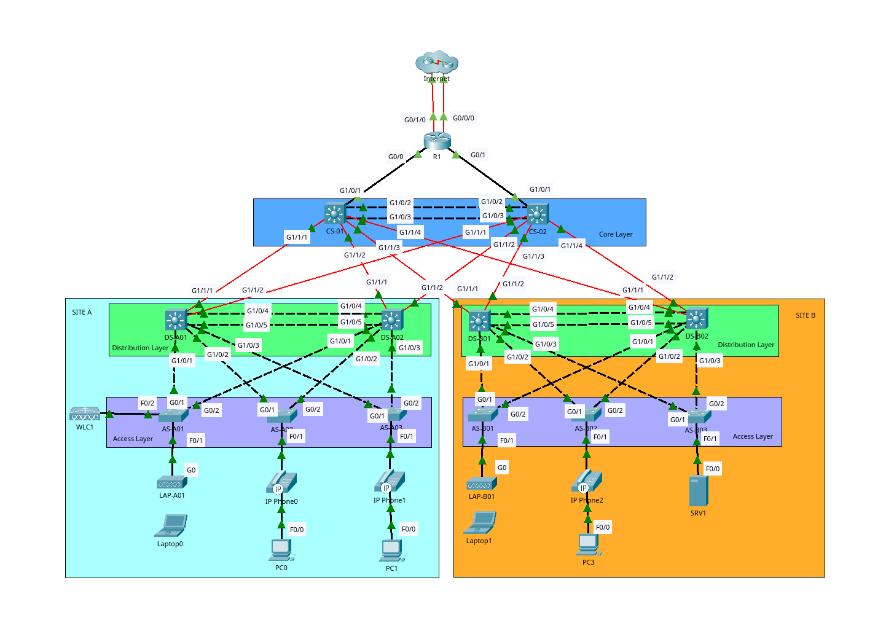

# Campus Network Infrastructure (3-Tier Enterprise Design)

The project reflects corporate networking standards, implementing advanced Layer 2 security, high availability, dynamic routing, enterprise services, and a structured IPv6 migration path.

  

---

## Lab Access Credentials

* **Local Username:** cisco
* **Password:** asd
* **Enable Password:** asd

## Architecture & Core Concepts

The network leverages a classic **3-Tier Hierarchical Design** to ensure scalability, predictable performance, and high fault tolerance. 

### Core Layer
* Consists of **CS-01** and **CS-02** acting as the high-speed backbone.
* Layer 3 EtherChannel is configured between Core switches using **PaGP** to aggregate bandwidth and avoid routing loops.
* **IP Routing** is enabled across all Core and Distribution switches.

### Distribution Layer
* Bridges the Core backbone to the Access edge, handling policy-based traffic steering and boundaries.
* Configured as the **HSRPv2** Active and Standby gateways to provide immediate default gateway redundancy.
* Acts as the **VTPv2 Server** to centralize VLAN management down to the Access switches.

## Access Layer

* Access switches operate as VTP Clients to automatically synchronize VLAN configurations across the network.
* Uplinks to the Distribution Layer are deployed over Gigabit Ethernet interfaces configured as static 802.1Q trunk links to prevent bandwidth bottlenecks.
* End-user devices connect to the network infrastructure via standard Fast Ethernet access ports.
* Dynamic Trunking Protocol is globally disabled to mitigate security risks and all unused switch ports are explicitly shut down to prevent unauthorized physical access.

---

## Network Addressing Schema

The network segregates departments and traffic types into distinct subnets to minimize broadcast domains and enforce security controls.

### Local Area Networks (LAN) & HSRP Configuration

| Site | VLAN | Purpose | Subnet | Virtual IP (VIP) | Active Gateway | Standby Gateway |
| :--- | :---: | :--- | :--- | :--- | :--- | :--- |
| **Site A** | 10 | PCs | `10.1.0.0/24` | `10.1.0.1` | DSW-A1 (+5 Prio, Preempt) | DSW-A2 |
| **Site A** | 20 | IP Phones | `10.2.0.0/24` | `10.2.0.1` | DSW-A2 (+5 Prio, Preempt) | DSW-A1 |
| **Site A** | 40 | Wi-Fi Users | `10.6.0.0/24` | `10.6.0.1` | DSW-A2 (+5 Prio, Preempt) | DSW-A1 |
| **Site A** | 99 | Management | `10.0.0.0/28` | `10.0.0.1` | DSW-A1 (+5 Prio, Preempt) | DSW-A2 |
| **Site B** | 10 | PCs | `10.3.0.0/24` | `10.3.0.1` | DSW-B1 (+5 Prio, Preempt) | DSW-B2 |
| **Site B** | 20 | IP Phones | `10.4.0.0/24` | `10.4.0.1` | DSW-B2 (+5 Prio, Preempt) | DSW-B1 |
| **Site B** | 30 | Central Servers| `10.5.0.0/24` | `10.5.0.1` | DSW-B2 (+5 Prio, Preempt) | DSW-B1 |
| **Site B** | 99 | Management | `10.0.0.16/28` | `10.0.0.17` | DSW-B1 (+5 Prio, Preempt) | DSW-B2 |
| **Both** | 1000| Native VLAN | Unused | *None* | *None* | *None* |

### Device Infrastructure Interfaces (IPv4 & IPv6)

| Device | Interface | IPv4 Address | IPv6 Address / Prefix |
| :--- | :--- | :--- | :--- |
| **R1** | `G0/0/0` | DHCP Client | `2001:db8:a::2/64` |
| | `G0/1/0` | DHCP Client | `2001:db8:b::2/64` |
| | `G0/0` | `10.0.0.33/30` | `2001:db8:a1::/64` (EUI-64) |
| | `G0/1` | `10.0.0.37/30` | `2001:db8:a2::/64` (EUI-64) |
| | `Loopback0` | `10.0.0.76/32` | *N/A* |
| **CSW1** | `G1/0/1` | `10.0.0.34/30` | `2001:db8:a1::/64` (EUI-64) |
| | `Po1` (to CSW2) | `10.0.0.41/30` | Enabled (No Explicit Global IP) |
| | `Loopback0` | `10.0.0.77/32` | *N/A* |
| **CSW2** | `G1/0/1` | `10.0.0.38/30` | `2001:db8:a2::/64` (EUI-64) |
| | `Po1` (to CSW1) | `10.0.0.42/30` | Enabled (No Explicit Global IP) |
| | `Loopback0` | `10.0.0.78/32` | *N/A* |

---

## Implementation Details

### Layer 2 Optimization & Spanning Tree
To maximize link utilization and prevent data loops, the access infrastructure deploys **Rapid-PVST+**. 
* **STP Priorities** align precisely with HSRP behaviors. The designated HSRP Active Router for a VLAN is configured with the lowest possible STP priority to become the Root Bridge. The Standby HSRP router is set one priority increment higher.
* EtherChannel mechanisms ensure port resilience: Site A relies on **PaGP** (Desirable Mode) while Site B operates on **LACP** (Active Mode).
* **PortFast** and **BPDU Guard** are active on all end-host facing ports to grant fast access while blocking accidental loop injections.

### Routing Protocols (OSPF & Static)
* **OSPFv2 (Process ID 1, Area 0)** runs over all LAN-facing interfaces on R1, Core, and Distribution switches. 
* Router IDs (**RID**) match the respective Loopback0 addresses. 
* Physical connections between OSPF neighbors are optimized via a network type that bypasses DR/BDR elections (except over the Core L3 PortChannels which retain default behaviors).
* SVIs (except the Management VLAN) and Loopback interfaces are marked **passive** to block unwanted routing advertisements.
* **Internet Gateways**: R1 uses recursive static default routes pointing to the ISP. The path via `G0/1/0` acts as a backup floating static route with an increased Administrative Distance. R1 injects this default route dynamically into OSPF as an **ASBR**.
* **IPv6 Strategy**: To ensure future compatibility, IPv6 unicast routing is operational. R1 processes dual IPv6 default routes (a recursive path via `2001:db8:a::1` and a floating fully-specified route via `2001:db8:b::1`).

### Infrastructure & Security Integration

#### Network Infrastructure Services
* **DHCP**: Centralized on R1. Distribution switches act as DHCP relays, forwarding broadcast discovery requests directly to R1's Loopback0 IP. The first 10 addresses of each scope are reserved and excluded from leasing.
* **DNS (SRV1)**: Manages lookups for global domains alongside a custom domain tied back to all network appliances.
* **NTP & Management**: R1 acts as a Stratum 5 NTP server fetching accurate time from an external authoritative source. All core and access devices synchronize directly to R1. Centralized logging is captured via a **Syslog** service pushing data straight to SRV1 with an internal local logging buffer of 8192 bytes.

#### Security Hardening
* **Access Control Lists (ACLs)**: Implemented an extended ACL (`SiteA_to_SiteB`) to permit standard diagnostic ICMP requests between client subnets while filtering out unauthorized cross-site traffic types.
* **Secure Management**: Local authentication utilizes modern Type 9 hash standards where supported, falling back to Type 5 where necessary. Device access is locked down strictly via **SSHv2** utilizing maximum RSA modulus sizes. An ACL bound to all virtual lines (VTY) restricts terminal management exclusively to the Site A PC subnet. 
* **Edge Security**: Edge client ports run strict **Port Security** enforcing single MAC learning with sticky configurations. Violations run in a restrictive mode that drops malicious frames and triggers snmp/syslog warnings without taking the interface down.
* **Man-In-The-Middle Protection**: Dynamic ARP Inspection (**DAI**) and **DHCP Snooping** run in unison across all active access VLANs. Trunk paths and WLC uplinks are marked as trusted, whereas local user edge ports remain untrusted and bound to strict rate limiting (15 packets per second).

---

## Wireless Network Architecture

An enterprise **Cisco Wireless LAN Controller** named **WLC1** handles centralized wireless integration from its physical deployment within **Site A**.

* **Centralized Management** uses two **Lightweight APs** named **LAP-A01** and **LAP-B01** operating in **Local Mode** to provide seamless wireless coverage across different corporate sites.
* **Cross-Site Routing** connects **LAP-A01** locally within **Site A** while **LAP-B01** is deployed remotely at **Site B**, requiring routing across the infrastructure to reach the controller.
* **Controller Discovery** allows the remote AP **LAP-B01** to find the centralized controller across the network using **DHCP Option 43** configured within the **B-Mgmt** pool.
* **CAPWAP Tunneling** builds secure **Layer 3 CAPWAP tunnels** back to **WLC1** where both access points reside within dedicated management networks.
* **Traffic Mapping** encapsulates all wireless client traffic directly to **WLC1** which maps the data through to the dedicated client network on **VLAN 40**.
* **Over-the-Air Confidentiality** secures the broadcast **SSID** through **WPA2 Enterprise** and **PSK** authentication with **AES Encryption**.

**Note**: Due to Packet Tracer’s limitations, wireless clients won’t be able to lease an IP address from the Wi-Fi DHCP pool.

